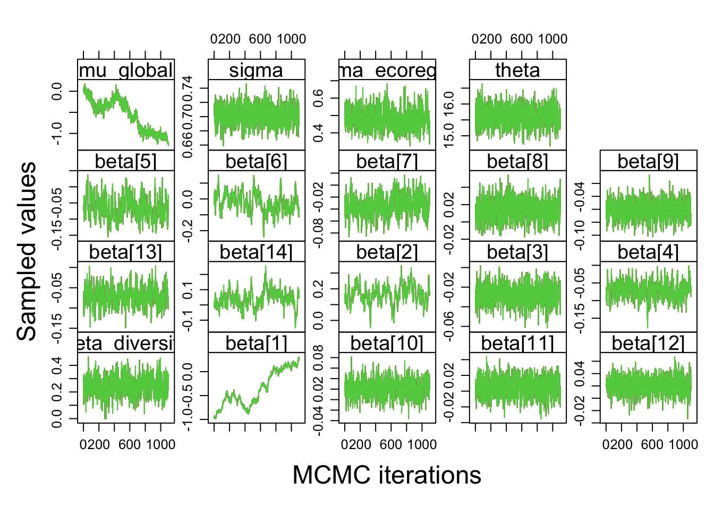
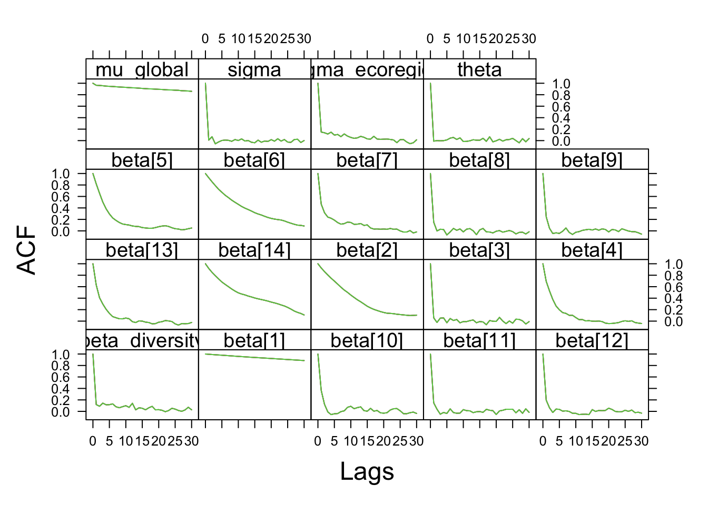
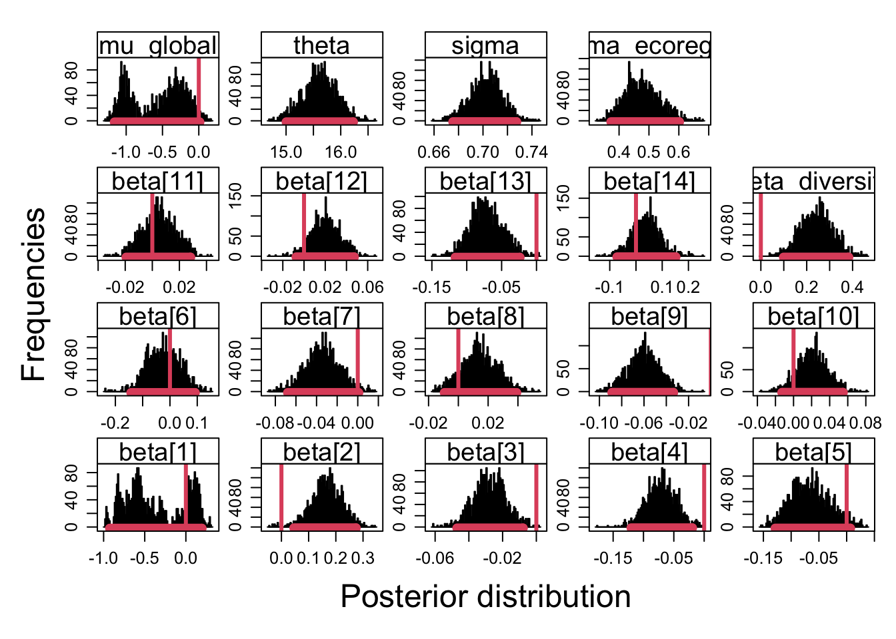
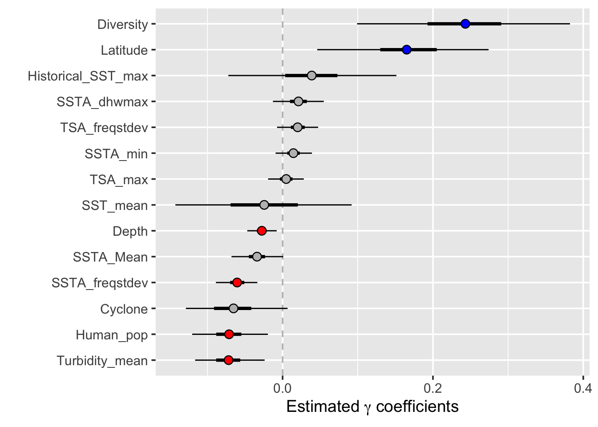

# Overview

This script runs the hierarchical beta regression model using the pre-processed 
`data_for_maps.csv` file, which already contains:
- Filtered data (NA values and invalid observations removed)
- Pre-computed `site` and `region` indices
- Pre-computed `diversity.standardized` values

This allows direct comparison with the Python implementation which also uses
`data_for_maps.csv`.

<!-- XXX: This script assumes that *all* filtering and preprocessing steps in the
original `1_run_the_beta_model.Rmd` (e.g. NA removals, turbidity threshold,
shapefile-based ecoregion assignment, diversity join) have already been applied
when `data_for_maps.csv` was created. If any of those steps were different or
omitted when generating `data_for_maps.csv`, this pipeline cannot reproduce the
paper results exactly from the raw inputs. -->


``` r
library(R2jags)
```

```
## Loading required package: rjags
```

```
## Loading required package: coda
```

```
## Linked to JAGS 4.3.2
```

```
## Loaded modules: basemod,bugs
```

```
## 
## Attaching package: 'R2jags'
```

```
## The following object is masked from 'package:coda':
## 
##     traceplot
```

``` r
library(dplyr)
```

```
## 
## Attaching package: 'dplyr'
```

```
## The following objects are masked from 'package:stats':
## 
##     filter, lag
```

```
## The following objects are masked from 'package:base':
## 
##     intersect, setdiff, setequal, union
```

``` r
library(ggplot2)
```


``` r
default_data_dir <- "/Users/rt582/Library/CloudStorage/OneDrive-UniversityofCambridge/cambridge/phd/Paper_Conferences/reef_cover_economics/data/sully_og"
data_dir <- Sys.getenv("BETA_DATA_DIR", unset = default_data_dir)
output_dir <- Sys.getenv("BETA_OUTPUT_DIR", unset = file.path(data_dir, "output"))
dir.create(output_dir, recursive = TRUE, showWarnings = FALSE)
BETA_SMOKE <- identical(Sys.getenv("BETA_SMOKE"), "1")
if (BETA_SMOKE) {
  mcmc_cfg <- list(
    n_chains = as.integer(Sys.getenv("BETA_SMOKE_N_CHAINS", unset = "2")),
    n_burnin = as.integer(Sys.getenv("BETA_SMOKE_N_BURNIN", unset = "5")),
    n_iter = as.integer(Sys.getenv("BETA_SMOKE_N_ITER", unset = "20")),
    n_thin = 1L,
    run_serial = TRUE,
    use_parallel = FALSE
  )
  message("BETA_SMOKE=1: tiny subsample, serial JAGS only.")
} else {
  mcmc_cfg <- list(n_chains = 3L, n_burnin = 4000L, n_iter = 15000L, n_thin = 10L, use_parallel = TRUE)
}

native_r <- Sys.getenv(
  "BETA_NATIVE_R",
  unset = normalizePath(file.path(data_dir, "..", "..", "src", "native_r"), wins = FALSE, mustWork = FALSE)
)
source(file.path(native_r, "beta_model_reparam_utils.R"))
```


``` r
# Load pre-processed model-ready data (default: data_for_maps.csv from original pipeline).
data_path <- Sys.getenv(
  "BETA_DATA_PATH",
  unset = file.path(data_dir, "data_for_maps.csv")
)
data <- read.csv(data_path, header = TRUE)

if (BETA_SMOKE) {
  max_sites <- as.integer(Sys.getenv("BETA_SMOKE_MAX_SITES", unset = "12"))
  set.seed(20260529L)
  keep_sites <- sample(unique(data$site), min(max_sites, length(unique(data$site))))
  data <- data[data$site %in% keep_sites, ]
  message(sprintf(
    "BETA_SMOKE subsample: %d rows | %d sites | %d regions",
    nrow(data), length(unique(data$site)), length(unique(data$region))
  ))
}

cat(paste("Loaded", nrow(data), "observations\n"))
```

```
## Loaded 7714 observations
```

``` r
cat(paste("Number of unique sites:", length(unique(data$site)), "\n"))
```

```
## Number of unique sites: 2949
```

``` r
cat(paste("Number of unique regions:", length(unique(data$region)), "\n"))
```

```
## Number of unique regions: 83
```

``` r
# Check the site and region ranges
cat(paste("\nSite range:", min(data$site), "-", max(data$site), "\n"))
```

```
## 
## Site range: 1 - 2949
```

``` r
cat(paste("Region range:", min(data$region), "-", max(data$region), "\n"))
```

```
## Region range: 2 - 150
```


``` r
# The data_for_maps.csv already has:
# - site: R's pre-computed site index (1-based, but may not be consecutive)
# - region: R's pre-computed region index (1-based, but may not be consecutive)
# - diversity.standardized: Pre-computed standardized diversity per ecoregion

# Check column names
cat(paste(names(data), "\n"))
```

```
## Reef_ID 
##  Latitude.Degrees 
##  Longitude.Degrees 
##  Ocean 
##  Realm 
##  Ecoregion.x 
##  Country_Name 
##  State_Island_Province 
##  City_Town 
##  City_Town_2 
##  City_Town_3 
##  Depth 
##  Organism.Code 
##  Bleaching_S1 
##  Bleaching_S2 
##  Bleaching_S3 
##  Bleaching_S4 
##  Average_Bleaching 
##  Average_coral_cover 
##  days_since_19811231 
##  ClimSST 
##  SST_mean 
##  SST_min 
##  SST_max 
##  SST_stdev 
##  SSTA_stdev 
##  SSTA_Mean 
##  SSTA_min 
##  SSTA_max 
##  SSTA_freqstdev 
##  SSTA_freqmax 
##  SSTA_freqmean 
##  SSTA_dhwstdev 
##  SSTA_dhwmax 
##  SSTA_dhwmean 
##  TSA_stdev 
##  TSA_min 
##  TSA_max 
##  TSA_mean 
##  TSA_freqstdev 
##  TSA_freqmax 
##  TSA_freqmean 
##  TSA_dhwstdev 
##  TSA_dhwmax 
##  TSA_dhwmean 
##  reef 
##  Cyclone 
##  Turbidity_mean 
##  Turbidity_max 
##  Turbidity_min 
##  Historical_SST_mean 
##  Historical_SST_max 
##  Historical_SST_sd 
##  human_pop_2050_vals 
##  human_pop_2100_vals 
##  Human_pop 
##  sst_mean_rcp45_2050 
##  sst_mean_rcp45_2100 
##  sst_max_rcp45_2050 
##  sst_max_rcp45_2100 
##  sst_mean_rcp85_2050 
##  sst_mean_rcp85_2100 
##  sst_max_rcp85_2050 
##  sst_max_rcp85_2100 
##  mean_tsa_dhw_rcp45_2050 
##  max_tsa_dhw_rcp45_2050 
##  mean_tsa_dhw_rcp45_2100 
##  max_tsa_dhw_rcp45_2100 
##  mean_tsa_dhw_rcp85_2050 
##  max_tsa_dhw_rcp85_2050 
##  mean_tsa_dhw_rcp85_2100 
##  max_tsa_dhw_rcp85_2100 
##  Longitude 
##  ERG 
##  lon 
##  lat 
##  Ecoregion.y 
##  ERName 
##  diversity.standardized 
##  site 
##  region 
##  coral_cover_Beta 
##  deviations_from_expected 
##  Y_New 
##  Y_future_RCP45_yr_2050 
##  Y_future_RCP45_yr_2100 
##  Y_future_RCP85_yr_2050 
##  Y_future_RCP85_yr_2100 
##  Y_future_RCP45_yr_2050_change 
##  Y_future_RCP45_yr_2100_change 
##  Y_future_RCP85_yr_2050_change 
##  Y_future_RCP85_yr_2100_change
```


``` r
# Standardize the predictors using the same function as the original
standardize_function <- function(x) {
  x.standardized <- (x - mean(na.omit(x))) / sd(na.omit(x))
  return(x.standardized)
}

# Use absolute latitude (same as original)
data$lat <- abs(data$Latitude.Degrees)

# Standardize environmental variables
# These are the raw values that need standardization for the model
X_standardized <- data.frame(
  lat = standardize_function(data$lat),
  Depth = standardize_function(data$Depth),
  Human_pop = standardize_function(data$Human_pop),
  Cyclone = standardize_function(data$Cyclone),
  SST_mean = standardize_function(data$SST_mean),
  SSTA_Mean = standardize_function(data$SSTA_Mean),
  SSTA_min = standardize_function(data$SSTA_min),
  SSTA_freqstdev = standardize_function(data$SSTA_freqstdev),
  SSTA_dhwmax = standardize_function(data$SSTA_dhwmax),
  TSA_max = standardize_function(data$TSA_max),
  TSA_freqstdev = standardize_function(data$TSA_freqstdev),
  Turbidity_mean = standardize_function(data$Turbidity_mean),
  Historical_SST_max = standardize_function(data$Historical_SST_max)
)

# Print standardization stats for comparison with Python
cat(paste("\nStandardization stats for comparison:\n"))
```

```
## 
## Standardization stats for comparison:
```

``` r
for (col in c("lat", "Depth", "Human_pop", "Cyclone", "SST_mean", "SSTA_Mean", 
              "SSTA_min", "SSTA_freqstdev", "SSTA_dhwmax", "TSA_max", 
              "TSA_freqstdev", "Turbidity_mean", "Historical_SST_max")) {
  if (col == "lat") {
    raw_col <- data$lat # TODO: why this?
  } else {
    raw_col <- data[[col]]
  }
  cat(paste(sprintf("  %s: mean=%.6f, sd=%.6f\n", col, mean(na.omit(raw_col)), sd(na.omit(raw_col)))))
}
```

```
##   lat: mean=13.131069, sd=7.448280
##   Depth: mean=6.371493, sd=3.486983
##   Human_pop: mean=32158.227644, sd=138226.881360
##   Cyclone: mean=0.047551, sd=0.079552
##   SST_mean: mean=300.843424, sd=1.559409
##   SSTA_Mean: mean=0.138097, sd=0.220087
##   SSTA_min: mean=-2.015324, sd=0.653092
##   SSTA_freqstdev: mean=3.593749, sd=2.155323
##   SSTA_dhwmax: mean=10.323674, sd=6.616292
##   TSA_max: mean=1.685871, sd=0.646867
##   TSA_freqstdev: mean=1.332758, sd=1.032955
##   Turbidity_mean: mean=0.074031, sd=0.055352
##   Historical_SST_max: mean=303.917578, sd=0.979099
```


``` r
# Build design matrix - same as original
X <- model.matrix(~ lat + Depth + Human_pop + Cyclone + SST_mean + SSTA_Mean + 
                    SSTA_min + SSTA_freqstdev + SSTA_dhwmax + TSA_max + 
                    TSA_freqstdev + Turbidity_mean + Historical_SST_max, 
                  data = X_standardized)

cat(paste("Design matrix dimensions:", dim(X), "\n"))
```

```
## Design matrix dimensions: 7714 
##  Design matrix dimensions: 14
```

``` r
cat(paste("Column names:", colnames(X), "\n"))
```

```
## Column names: (Intercept) 
##  Column names: lat 
##  Column names: Depth 
##  Column names: Human_pop 
##  Column names: Cyclone 
##  Column names: SST_mean 
##  Column names: SSTA_Mean 
##  Column names: SSTA_min 
##  Column names: SSTA_freqstdev 
##  Column names: SSTA_dhwmax 
##  Column names: TSA_max 
##  Column names: TSA_freqstdev 
##  Column names: Turbidity_mean 
##  Column names: Historical_SST_max
```

``` r
K <- ncol(X)
N <- nrow(data)
```


``` r
# CRITICAL: Create dense, consecutive indices for JAGS
# The site and region columns in data_for_maps.csv may not be consecutive (e.g., 1, 5, 10, ...)
# We need to map them to 1, 2, 3, ... for JAGS

# XXX: In the original script, `site` and region indices are built on the fly:
#   - `site` from `sites_and_region_df$site` (numeric factor of `Reef_ID`)
#   - `region_for_each_site` as a factor of `sites_and_region_df$region`
#   - diversity values coming from a separate CSV joined by ecoregion name.
# Here we instead rely on `data$site` and `data$region` that were precomputed
# during creation of `data_for_maps.csv`, and we compress them to dense
# indices. This is only equivalent if the original authors built these columns
# exactly as in `1_run_the_beta_model.Rmd`; otherwise the site/region mapping
# and hence random-effects structure may differ from the published model.

# Create site mapping: sparse R indices -> dense consecutive indices
unique_sites <- sort(unique(data$site))
site_map <- setNames(1:length(unique_sites), unique_sites)
data$site_dense <- site_map[as.character(data$site)]

# Create region mapping: sparse R indices -> dense consecutive indices  
unique_regions <- sort(unique(data$region))
region_map <- setNames(1:length(unique_regions), unique_regions)
data$region_dense <- region_map[as.character(data$region)]

Nre <- length(unique_sites)  # Number of unique sites
R <- length(unique_regions)   # Number of unique regions
re <- data$site_dense         # Dense site index for each observation

cat(paste("Number of sites (Nre):", Nre, "\n"))
```

```
## Number of sites (Nre): 2949
```

``` r
cat(paste("Number of regions (R):", R, "\n"))
```

```
## Number of regions (R): 83
```

``` r
# Create site-to-region mapping
# This needs to be ordered by dense site index (1, 2, 3, ...)
site_region_df <- data %>% 
  distinct(site_dense, region_dense) %>% 
  arrange(site_dense)

# CRITICAL: Verify that sites map to the correct regions
# region_for_each_site[s] should give the region for site s
region_for_each_site <- site_region_df$region_dense
cat(paste("Length of region_for_each_site:", length(region_for_each_site), "\n"))
```

```
## Length of region_for_each_site: 2949
```

``` r
cat(paste("Should equal Nre:", Nre, "\n"))
```

```
## Should equal Nre: 2949
```

``` r
# Verify the mapping is correct
stopifnot(length(region_for_each_site) == Nre)
stopifnot(all(site_region_df$site_dense == 1:Nre))
```


``` r
# Get diversity per region (ordered by dense region index)
# diversity.standardized is already in the data from R's original processing
# XXX: In the original pipeline, `diversity.standardized` is computed from
# `coral_diversity_for_coral_cover.csv` and joined to ecoregions by name,
# *before* building the JAGS data list. Here we assume that the single
# `diversity.standardized` column in `data_for_maps.csv` is exactly that
# same standardized vector. If a different diversity file or join logic was
# used when exporting the CSV, the diversity effect (`beta_diversity`) in
# this script will not correspond to the published analysis.
diversity_df <- data %>%
  distinct(region_dense, diversity.standardized) %>%
  arrange(region_dense)

diversity <- diversity_df$diversity.standardized

cat(paste("Diversity vector length:", length(diversity), "\n"))
```

```
## Diversity vector length: 83
```

``` r
cat(paste("Should equal R:", R, "\n"))
```

```
## Should equal R: 83
```

``` r
cat(paste("Diversity range:", range(diversity), "\n"))
```

```
## Diversity range: -1.295278204 
##  Diversity range: 1.877856627
```

``` r
stopifnot(length(diversity) == R)
```


``` r
# Transform coral cover for beta distribution
# y_beta = (y * (N-1) + 0.5) / N
data$coral_cover_Beta <- (data$Average_coral_cover * (N - 1) + 0.5) / N

cat(paste("Response variable (coral_cover_Beta):\n"))
```

```
## Response variable (coral_cover_Beta):
```

``` r
cat(paste("  Range:", range(data$coral_cover_Beta), "\n"))
```

```
##   Range: 0.00631400700025927 
##    Range: 0.987436803214934
```

``` r
cat(paste("  Mean:", mean(data$coral_cover_Beta), "\n"))
```

```
##   Mean: 0.331569186239179
```


``` r
# Prepare data for JAGS
win.data <- list(
  Y = data$coral_cover_Beta,
  N = N,
  X = X,
  K = K,
  re = re,                                  # Dense site index for each obs
  R = R,                                    # Number of regions
  Nre = Nre,                                # Number of sites
  region_for_each_site = region_for_each_site,  # CRITICAL: correctly ordered
  diversity = diversity                     # Ordered by dense region index
)

cat(paste("\nJAGS data summary:\n"))
```

```
## 
## JAGS data summary:
```

``` r
cat(paste("  N (observations):", win.data$N, "\n"))
```

```
##   N (observations): 7714
```

``` r
cat(paste("  K (predictors):", win.data$K, "\n"))
```

```
##   K (predictors): 14
```

``` r
cat(paste("  Nre (sites):", win.data$Nre, "\n"))
```

```
##   Nre (sites): 2949
```

``` r
cat(paste("  R (regions):", win.data$R, "\n"))
```

```
##   R (regions): 83
```


``` r
# Write JAGS model (same as original)
model_path <- file.path(output_dir, "GLMM_coral_cover_preprocessed.txt")
sink(model_path)
cat("
    model{
    #1A. Priors for fixed effects (vague priors: precision 0.0001 = SD 100)
    for (i in 1:K) { beta[i] ~ dnorm(0, 0.0001) }
    
    # Hierarchical random effects
    for (i in 1:Nre) { a[i] ~ dnorm(ecoregion[region_for_each_site[i]], tau) }
    
    # Ecoregion effects with diversity predictor
    for(z in 1:R){
      ecoregion[z] ~ dnorm(g[z], tau_ecoregion)
      g[z] <- mu_global + beta_diversity * diversity[z]
    }
    
    mu_global ~ dnorm(0, 0.0001)      # Global mean prior
    beta_diversity ~ dnorm(0, 0.0001) # Diversity slope prior
    
    #1B. Half-Cauchy(25) prior for site-level SD
    num ~ dnorm(0, 0.0016) 
    denom ~ dnorm(0, 1)
    sigma <- abs(num / denom)
    tau <- 1 / (sigma * sigma)
    
    #1C. Half-Cauchy(25) prior for ecoregion-level SD
    num_ecoregion ~ dnorm(0, 0.0016) 
    denom_ecoregion ~ dnorm(0, 1)
    sigma_ecoregion <- abs(num_ecoregion / denom_ecoregion)
    tau_ecoregion <- 1 / (sigma_ecoregion * sigma_ecoregion)
    
    #1D. Half-Cauchy(25) prior for precision parameter theta
    numtheta ~ dnorm(0, 0.0016) 
    denomtheta ~ dnorm(0, 1)
    theta <- abs(numtheta / denomtheta)

    #2. Likelihood 
    for (i in 1:N){       
      Y[i] ~ dbeta(shape1[i], shape2[i])
      shape1[i] <- theta * pi[i]
      shape2[i] <- theta * (1 - pi[i])
      
      logit(pi[i]) <- eta[i]
      eta[i] <- inprod(beta[], X[i,]) + a[re[i]]

      # Expected value and variance
      ExpY[i] <- pi[i] 
      VarY[i] <- pi[i] * (1 - pi[i]) / (theta + 1)
      PRes[i] <- (Y[i] - ExpY[i]) / sqrt(VarY[i])

      # Posterior predictive check
      YNew[i] ~ dbeta(shape1[i], shape2[i])
      PResNew[i] <- (YNew[i] - ExpY[i]) / sqrt(VarY[i])
      D[i] <- pow(PRes[i], 2)
      DNew[i] <- pow(PResNew[i], 2)
    } 
    
    Fit <- sum(D[1:N])
    FitNew <- sum(DNew[1:N]) 
}
", fill = TRUE)
sink()
```


``` r
init_seed <- as.integer(Sys.getenv("BETA_INIT_SEED", unset = "20260529"))

params <- c("beta", "beta_diversity", "a", "theta", "PRes", "Fit", "FitNew", 
            "YNew", "ecoregion", "sigma", "sigma_ecoregion", "mu_global")
```


``` r
cat(paste("Running JAGS model...\n"))
```

```
## Running JAGS model...
```

``` r
if (BETA_SMOKE) {
  cat(paste("BETA_SMOKE=1: serial JAGS with n.chains=", mcmc_cfg$n_chains,
            " n.burnin=", mcmc_cfg$n_burnin, " n.iter=", mcmc_cfg$n_iter, "\n", sep = ""))
} else {
  cat(paste("This may take several minutes.\n"))
}
```

```
## This may take several minutes.
```

``` r
J0 <- run_centered_jags_fit(
  win.data = win.data,
  model_path = model_path,
  params = params,
  K = K,
  Nre = Nre,
  mcmc_cfg = mcmc_cfg,
  init_seed = init_seed,
  progress_bar = if (BETA_SMOKE) "none" else "text"
)
J0_parallel <- J0

cat(paste("JAGS model complete.\n"))
```

```
## JAGS model complete.
```


``` r
J0_instance <- J0
J0_type <- "single"

# out <- J0$BUGSoutput
out <- J0_instance$BUGSoutput

# Extract coefficient estimates
# Note: beta[1] is intercept, beta[2] is latitude, etc.
# XXX: The original script uses a custom `MyBUGSOutput()` helper to format
# beta summaries (means and quantiles) into `beta_est.csv`. Here we recreate
# those summaries manually from the posterior samples. Small differences in
# rounding, quantile definition, or variable ordering may mean that
# `beta_est_from_preprocessed.csv` is not byte-for-byte identical to the
# original `beta_est.csv`, even if the underlying posterior is the same.
beta_names <- c("Intercept", "Latitude", "Depth", "Human_pop", "Cyclone", 
                "SST_mean", "SSTA_Mean", "SSTA_min", "SSTA_freqstdev", 
                "SSTA_dhwmax", "TSA_max", "TSA_freqstdev", "Turbidity_mean", 
                "Historical_SST_max")

cat(paste("\n", paste(rep("=", 60), collapse=""), "\n"))
```

```
## 
##  ============================================================
```

``` r
cat(paste("COEFFICIENT ESTIMATES\n"))
```

```
## COEFFICIENT ESTIMATES
```

``` r
cat(paste(rep("=", 60), collapse=""), "\n\n")
```

```
## ============================================================
```

``` r
# Print coefficient summary
for (i in 1:K) {
  beta_samples <- out$sims.list$beta[, i]
  cat(paste(sprintf("%20s: mean=%7.4f, sd=%6.4f, 2.5%%=%7.4f, 97.5%%=%7.4f\n",
              beta_names[i], 
              mean(beta_samples), 
              sd(beta_samples),
              quantile(beta_samples, 0.025),
              quantile(beta_samples, 0.975))))
}
```

```
##            Intercept: mean=-0.3600, sd=0.3605, 2.5%=-0.9260, 97.5%= 0.1939
##             Latitude: mean= 0.1651, sd=0.0584, 2.5%= 0.0461, 97.5%= 0.2741
##                Depth: mean=-0.0277, sd=0.0098, 2.5%=-0.0470, 97.5%=-0.0079
##            Human_pop: mean=-0.0712, sd=0.0249, 2.5%=-0.1203, 97.5%=-0.0196
##              Cyclone: mean=-0.0653, sd=0.0353, 2.5%=-0.1287, 97.5%= 0.0066
##             SST_mean: mean=-0.0245, sd=0.0616, 2.5%=-0.1427, 97.5%= 0.0918
##            SSTA_Mean: mean=-0.0340, sd=0.0169, 2.5%=-0.0680, 97.5%= 0.0007
##             SSTA_min: mean= 0.0144, sd=0.0121, 2.5%=-0.0093, 97.5%= 0.0390
##       SSTA_freqstdev: mean=-0.0605, sd=0.0144, 2.5%=-0.0887, 97.5%=-0.0336
##          SSTA_dhwmax: mean= 0.0211, sd=0.0168, 2.5%=-0.0129, 97.5%= 0.0548
##              TSA_max: mean= 0.0048, sd=0.0123, 2.5%=-0.0193, 97.5%= 0.0282
##        TSA_freqstdev: mean= 0.0200, sd=0.0140, 2.5%=-0.0074, 97.5%= 0.0472
##       Turbidity_mean: mean=-0.0719, sd=0.0237, 2.5%=-0.1164, 97.5%=-0.0239
##   Historical_SST_max: mean= 0.0387, sd=0.0553, 2.5%=-0.0722, 97.5%= 0.1514
```

``` r
cat(paste(sprintf("\n%20s: mean=%7.4f, sd=%6.4f, 2.5%%=%7.4f, 97.5%%=%7.4f\n",
            "beta_diversity",
            mean(out$sims.list$beta_diversity),
            sd(out$sims.list$beta_diversity),
            quantile(out$sims.list$beta_diversity, 0.025),
            quantile(out$sims.list$beta_diversity, 0.975))))
```

```
## 
##       beta_diversity: mean= 0.2432, sd=0.0719, 2.5%= 0.0991, 97.5%= 0.3823
```

``` r
cat(paste(sprintf("%20s: mean=%7.4f, sd=%6.4f\n",
            "mu_global",
            mean(out$sims.list$mu_global),
            sd(out$sims.list$mu_global))))
```

```
##            mu_global: mean=-0.5680, sd=0.3721
```

``` r
cat(paste(sprintf("%20s: mean=%7.4f, sd=%6.4f\n",
            "theta",
            mean(out$sims.list$theta),
            sd(out$sims.list$theta))))
```

```
##                theta: mean=15.6195, sd=0.3111
```

``` r
cat(paste(sprintf("%20s: mean=%7.4f, sd=%6.4f\n",
            "sigma (site SD)",
            mean(out$sims.list$sigma),
            sd(out$sims.list$sigma))))
```

```
##      sigma (site SD): mean= 0.7024, sd=0.0133
```

``` r
cat(paste(sprintf("%20s: mean=%7.4f, sd=%6.4f\n",
            "sigma_ecoregion",
            mean(out$sims.list$sigma_ecoregion),
            sd(out$sims.list$sigma_ecoregion))))
```

```
##      sigma_ecoregion: mean= 0.4776, sd=0.0597
```


``` r
cat("\n", paste(rep("=", 60), collapse=""), "\n")
```

```
## 
##  ============================================================
```

``` r
cat(paste("CONVERGENCE DIAGNOSTICS (R-hat)\n"))
```

```
## CONVERGENCE DIAGNOSTICS (R-hat)
```

``` r
cat(paste(rep("=", 60), collapse=""), "\n\n")
```

```
## ============================================================
```

``` r
# Print R-hat for key parameters
print(J0_instance$BUGSoutput$summary[c(paste0("beta[", 1:K, "]"), "beta_diversity", 
                               "mu_global", "theta", "sigma", "sigma_ecoregion"),
                            c("mean", "sd", "2.5%", "97.5%", "Rhat", "n.eff")])
```

```
##                         mean          sd         2.5%         97.5%     Rhat
## beta[1]         -0.359995988 0.360462267 -0.925990716  0.1939186606 1.000543
## beta[2]          0.165073198 0.058385118  0.046056349  0.2740744325 1.000543
## beta[3]         -0.027661662 0.009781852 -0.047030624 -0.0078835530 1.000543
## beta[4]         -0.071218735 0.024886342 -0.120335081 -0.0195675741 1.000543
## beta[5]         -0.065313193 0.035285698 -0.128689490  0.0066066222 1.000543
## beta[6]         -0.024463828 0.061590217 -0.142704632  0.0918321464 1.000543
## beta[7]         -0.034024264 0.016879032 -0.067990226  0.0007464467 1.000543
## beta[8]          0.014377458 0.012111779 -0.009344944  0.0390125107 1.000543
## beta[9]         -0.060519472 0.014357275 -0.088737355 -0.0336159221 1.000543
## beta[10]         0.021132073 0.016824628 -0.012863795  0.0547734191 1.000543
## beta[11]         0.004774237 0.012323250 -0.019313083  0.0281624918 1.000543
## beta[12]         0.020002410 0.013950329 -0.007410532  0.0472165524 1.000543
## beta[13]        -0.071865344 0.023726479 -0.116417760 -0.0239275467 1.000543
## beta[14]         0.038746138 0.055313468 -0.072214570  0.1514007566 1.000543
## beta_diversity   0.243160671 0.071858128  0.099052916  0.3823397483 1.000543
## mu_global       -0.568043574 0.372068837 -1.161553924  0.0115521116 1.000543
## theta           15.619525747 0.311146155 15.003605802 16.2270297934 1.000543
## sigma            0.702433307 0.013265933  0.675417195  0.7273401400 1.000543
## sigma_ecoregion  0.477607197 0.059710888  0.373076119  0.6013151571 1.000543
##                 n.eff
## beta[1]          3300
## beta[2]          3300
## beta[3]          3300
## beta[4]          3300
## beta[5]          3300
## beta[6]          3300
## beta[7]          3300
## beta[8]          3300
## beta[9]          3300
## beta[10]         3300
## beta[11]         3300
## beta[12]         3300
## beta[13]         3300
## beta[14]         3300
## beta_diversity   3300
## mu_global        3300
## theta            3300
## sigma            3300
## sigma_ecoregion  3300
```


``` r
if (!BETA_SMOKE) {
mcmc_support_path <- file.path(data_dir, "MCMCSupportHighstatV4.R")
if (!file.exists(mcmc_support_path)) {
  mcmc_support_path <- file.path(
    Sys.getenv("BETA_NATIVE_R", unset = file.path(getwd(), "src", "native_r")),
    "MCMCSupportHighstatV4.R"
  )
}
source(mcmc_support_path)
# Visualise chains
# plot(J0_parallel)
# MyBUGSChains(J0_parallel$BUGSoutput, vars = c("beta", "beta_diversity", "mu_global", "theta", "sigma", "sigma_ecoregion"))

library(lattice)


param_names <- dimnames(J0_instance$BUGSoutput$sims.array)[[3]]
beta_names  <- grep("^beta\\[", param_names, value = TRUE)

sel <- c(beta_names, "beta_diversity", "mu_global", "theta", "sigma", "sigma_ecoregion")

log_root <- file.path(output_dir, "logs")
# make dir
if (!dir.exists(log_root)) {
  dir.create(log_root, recursive = TRUE)
}

# CHAIN PLOT
chains_plot <- MyBUGSChains(J0_instance$BUGSoutput, vars = sel)
png(
  file.path(
    log_root,
    sprintf("%s_chains.png", if (J0_type == "J0") "parallel" else J0_type)
  ),
  width = 9,
  height = 7,
  units = "in",
  res = 300
)
print(chains_plot)
dev.off()

# ACF PLOT
acf_plot <- MyBUGSACF(
  Output = J0_instance$BUGSoutput,
  SelectedVar = sel
)
png(
  file.path(
    log_root,
    sprintf("%s_acf.png", if (J0_type == "J0") "parallel" else J0_type)
  ),
  width = 9,
  height = 7,
  units = "in",
  res = 300
)
print(acf_plot)
dev.off()

# HISTOGRAM PLOT
hist_plot <- MyBUGSHist(
  Output = J0_instance$BUGSoutput,
  SelectedVar = sel
)
png(
  file.path(
    log_root,
    sprintf("%s_hist.png", if (J0_type == "J0") "parallel" else J0_type)
  ),
  width = 9,
  height = 7,
  units = "in",
  res = 300
)
print(hist_plot)
dev.off()
}
```



```
## quartz_off_screen 
##                 2
```

``` r
# Create summary dataframe (same format as original)
J1_df <- data.frame(
  variable = c("Latitude", "Depth", "Human_pop", "Cyclone", "SST_mean", 
               "SSTA_Mean", "SSTA_min", "SSTA_freqstdev", "SSTA_dhwmax", 
               "TSA_max", "TSA_freqstdev", "Turbidity_mean", "Historical_SST_max",
               "Diversity"),
  mean = c(sapply(2:K, function(i) mean(out$sims.list$beta[, i])),
           mean(out$sims.list$beta_diversity)),
  sd = c(sapply(2:K, function(i) sd(out$sims.list$beta[, i])),
         sd(out$sims.list$beta_diversity)),
  lower_2.5 = c(sapply(2:K, function(i) quantile(out$sims.list$beta[, i], 0.025)),
                quantile(out$sims.list$beta_diversity, 0.025)),
  upper_97.5 = c(sapply(2:K, function(i) quantile(out$sims.list$beta[, i], 0.975)),
                 quantile(out$sims.list$beta_diversity, 0.975)),
  lower_25 = c(sapply(2:K, function(i) quantile(out$sims.list$beta[, i], 0.25)),
               quantile(out$sims.list$beta_diversity, 0.25)),
  upper_75 = c(sapply(2:K, function(i) quantile(out$sims.list$beta[, i], 0.75)),
               quantile(out$sims.list$beta_diversity, 0.75))
)

# Save to CSV for comparison with Python
write.csv(J1_df, file.path(output_dir, "beta_est_from_preprocessed.csv"), row.names = FALSE)
cat(paste("\nSaved coefficient estimates to beta_est_from_preprocessed.csv\n"))
```

```
## 
## Saved coefficient estimates to beta_est_from_preprocessed.csv
```


``` r
# Determine significance colors
J1_df$color <- "gray"
J1_df$color[J1_df$mean > 0 & J1_df$lower_2.5 >= 0] <- "blue"
J1_df$color[J1_df$mean < 0 & J1_df$upper_97.5 <= 0] <- "red"

# Create coefficient plot
p <- ggplot(J1_df, aes(x = reorder(variable, mean), y = mean)) +
  geom_hline(yintercept = 0, linetype = "dashed", color = "gray") +
  geom_errorbar(aes(ymin = lower_2.5, ymax = upper_97.5), width = 0, size = 0.5) +
  geom_errorbar(aes(ymin = lower_25, ymax = upper_75), width = 0, size = 1.3) +
  geom_point(size = 3, shape = 21, fill = J1_df$color, color = "black") +
  coord_flip() +
  theme_gray(base_size = 14) +
  labs(x = "", y = expression(paste("Estimated ", gamma, " coefficients"))) +
  theme(legend.position = "none")
```

```
## Warning: Using `size` aesthetic for lines was deprecated in ggplot2 3.4.0.
## ℹ Please use `linewidth` instead.
## This warning is displayed once per session.
## Call `lifecycle::last_lifecycle_warnings()` to see where this warning was
## generated.
```

``` r
print(p)
```



``` r
ggsave(file.path(output_dir, "Beta_coeff_plot_from_preprocessed.png"), 
       p, width = 9, height = 7, dpi = 300)
cat("\nSaved coefficient plot to Beta_coeff_plot_from_preprocessed.png\n")
```

```
## 
## Saved coefficient plot to Beta_coeff_plot_from_preprocessed.png
```

``` r
if (BETA_SMOKE) {
  message("BETA_SMOKE=1: stopping after coefficient plot.")
  knitr::knit_exit()
}
```


``` r
# Model fit statistics
cat("\n", paste(rep("=", 60), collapse=""), "\n")
```

```
## 
##  ============================================================
```

``` r
cat("MODEL FIT\n")
```

```
## MODEL FIT
```

``` r
cat(paste(rep("=", 60), collapse=""), "\n\n")
```

```
## ============================================================
```

``` r
# Posterior predictive check
cat(sprintf("Fit (observed): mean = %.2f\n", mean(out$sims.list$Fit)))
```

```
## Fit (observed): mean = 7667.02
```

``` r
cat(sprintf("FitNew (replicated): mean = %.2f\n", mean(out$sims.list$FitNew)))
```

```
## FitNew (replicated): mean = 7710.74
```

``` r
cat(sprintf("Bayesian p-value: %.3f\n", mean(out$sims.list$FitNew > out$sims.list$Fit)))
```

```
## Bayesian p-value: 0.576
```

``` r
# DIC
cat(sprintf("DIC: %.2f\n", J0$BUGSoutput$DIC))
```

```
## DIC: -8861.62
```

``` r
cat(sprintf("pD (effective parameters): %.2f\n", J0$BUGSoutput$pD))
cat(sprintf("DIC: %.2f\n", J0_parallel$BUGSoutput$DIC))
```

```
## DIC: -8861.62
```

``` r
cat(sprintf("pD (effective parameters): %.2f\n", J0_parallel$BUGSoutput$pD))
```


``` r
# Get predictions
Y_New <- out$mean$YNew
Y_New[Y_New < 0] <- 0
Y_New[Y_New > 1] <- 1
# XXX: The original script additionally rounds `Y_New` to 2 decimal places
# before writing `data_for_maps.csv`:
#       Y_New <- round(Y_New, digits=2)
# Here we clamp to [0, 1] but do not round. If `data_for_maps.csv` stores the
# rounded values, a direct comparison of this `Y_New` with the CSV will not
# match exactly, even though the underlying posterior mean is the same.

# Calculate R-squared
r_squared <- summary(lm(data$Average_coral_cover ~ Y_New))$r.squared
cat(sprintf("\nR-squared (observed vs expected): %.4f\n", r_squared))
```

```
## 
## R-squared (observed vs expected): 0.7950
```

``` r
# Save predictions
data$Y_New_from_preprocessed <- Y_New
write.csv(data[, c("Reef_ID", "Latitude.Degrees", "Longitude.Degrees", 
                   "Average_coral_cover", "Y_New", "Y_New_from_preprocessed")],
          file.path(output_dir, "predictions_comparison.csv"), row.names = FALSE)
cat("Saved predictions to predictions_comparison.csv\n")
```

```
## Saved predictions to predictions_comparison.csv
```


``` r
cat("\n", paste(rep("=", 60), collapse=""), "\n")
```

```
## 
##  ============================================================
```

``` r
cat("ANALYSIS COMPLETE\n")
```

```
## ANALYSIS COMPLETE
```

``` r
cat(paste("Outputs written to:", output_dir, "\n"))
```

```
## Outputs written to: /Users/rt582/Library/CloudStorage/OneDrive-UniversityofCambridge/cambridge/phd/Paper_Conferences/reef_cover_economics/data/sully_og/output/comparison_runs/20260531_223711/02_preprocessed
```

``` r
cat(paste(rep("=", 60), collapse=""), "\n")
```

```
## ============================================================
```
